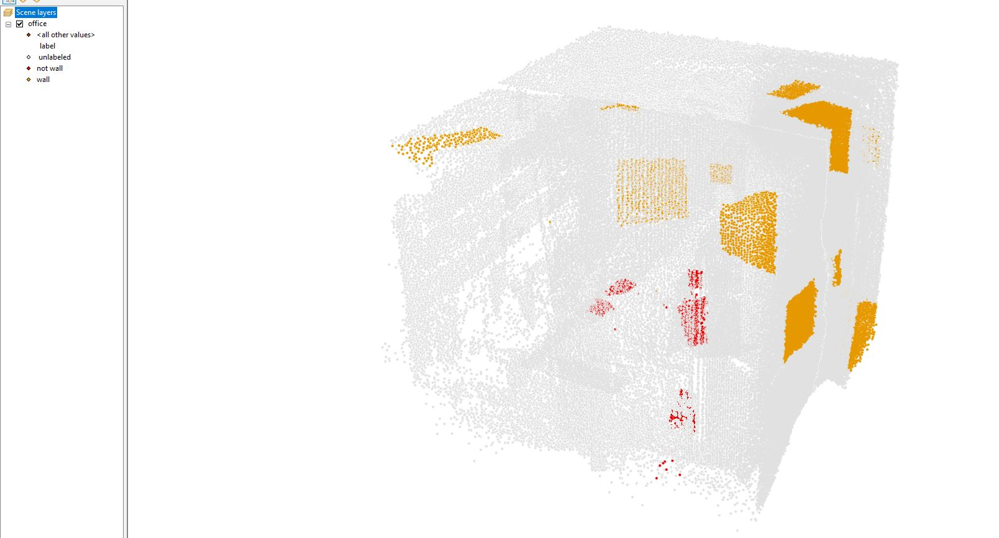
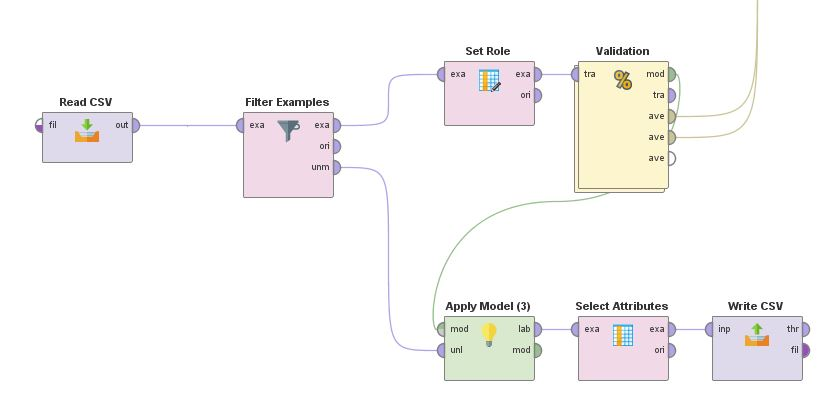
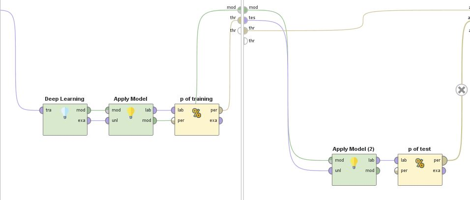
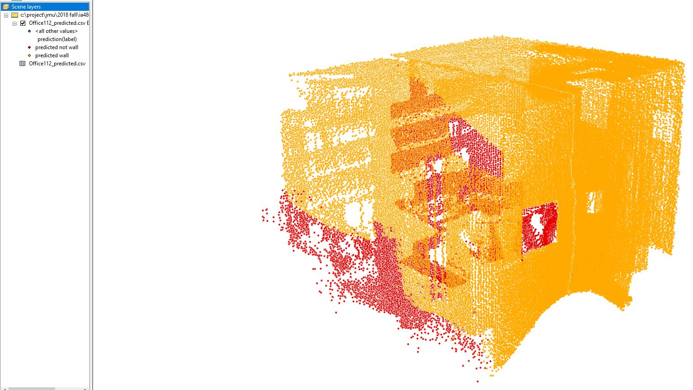

# Use Deep Learning Model to Classify LiDAR Points

1. Load the [LiDAR Points](https://github.com/xbwei/machine_learning_in_rapidminer/blob/master/deep_learning_classify_lidar/Office112.csv) into [ArcScene](http://desktop.arcgis.com/en/arcmap/latest/extensions/3d-analyst/3d-analyst-and-arcscene.htm) and label some points as "wall" or "not wall", and save it as a new csv file, e.g., office_labeled.
    * 

2. Read the office_labeled csv file in the [Deep Learning Model](https://github.com/xbwei/machine_learning_in_rapidminer/blob/master/deep_learning_classify_lidar/deep_learning_lidar_classify.xml) to calssify the unlabled points. Calcualte the model perforamnce on the training data and the test data. 
    * 
    * 

3. Import the predicted points in to ArcScene and dispaly the result. 
    * 
