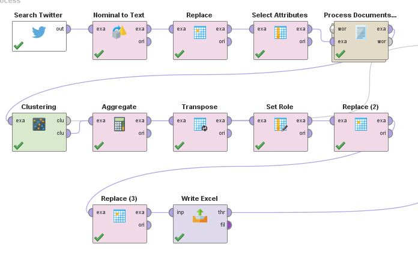
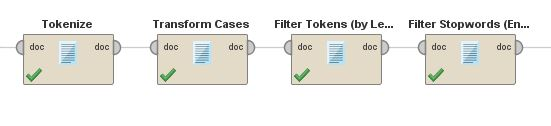
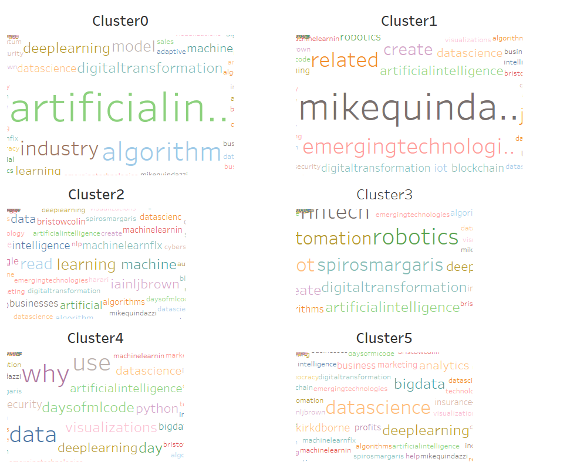

# Use K-Means Clustering to Classify Tweets
Use the [K-Means Clustering](https://github.com/xbwei/machine_learning_in_rapidminer/blob/master/kmeans_classify_tweets/k_means_classify_tweets.xml) process to group tweets with similar keywords together.

1. The Data Collection and K-Means Clustering:
    * 

2. The Process Document Process:
    * 
    
3. The Wordcloud:
    * 
          
