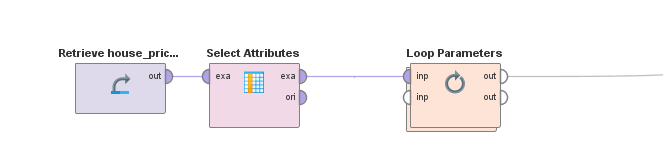
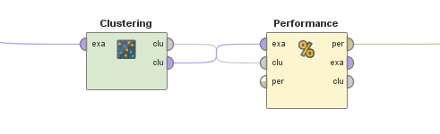

# K-Means Clustering

Use the [K-Means Clustering](https://github.com/xbwei/machine_learning_in_rapidminer/blob/master/kmeans_clustering/k_means.xml) operater to cluster the [house price](https://github.com/xbwei/machine_learning_in_rapidminer/blob/master/house_price_label.xlsx) data.

1. Import the data:

2. Use a loop operator to cluster the data with different k values:

