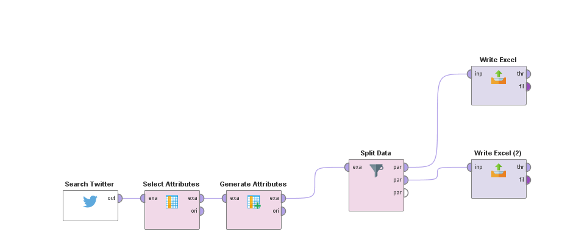
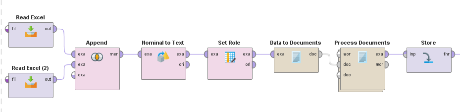
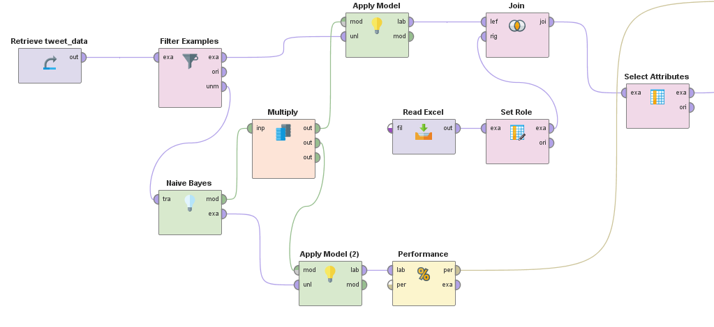

# Use Naive Bayes to Classify Tweets

1. [Collect Data](https://github.com/xbwei/machine_learning_in_rapidminer/blob/master/naive_bayes_classifiy_tweet/collect_tweet.xml)
    * 
    * Edit the [training data](https://github.com/xbwei/machine_learning_in_rapidminer/blob/master/naive_bayes_classifiy_tweet/traing.xlsx)
    * Keep the [unlabeled data](https://github.com/xbwei/machine_learning_in_rapidminer/blob/master/naive_bayes_classifiy_tweet/unlabeled.xlsx)   
2. [Process the Data](https://github.com/xbwei/machine_learning_in_rapidminer/blob/master/naive_bayes_classifiy_tweet/process_data.xml)
  
     
3. [Apply the Model](https://github.com/xbwei/machine_learning_in_rapidminer/blob/master/naive_bayes_classifiy_tweet/apply_model.xml)
  
